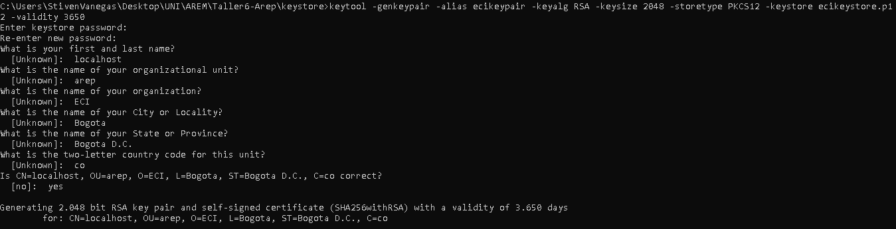
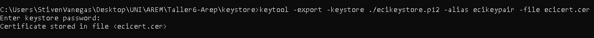
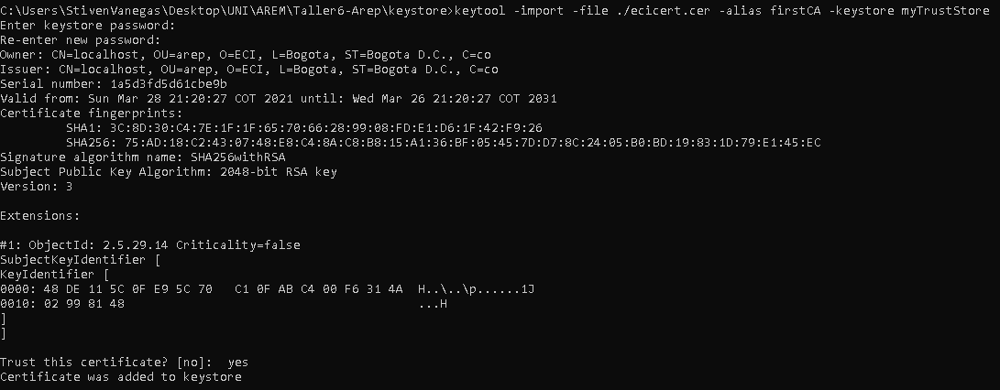
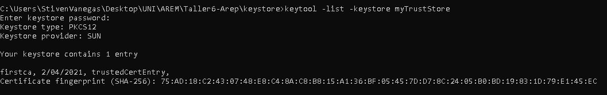
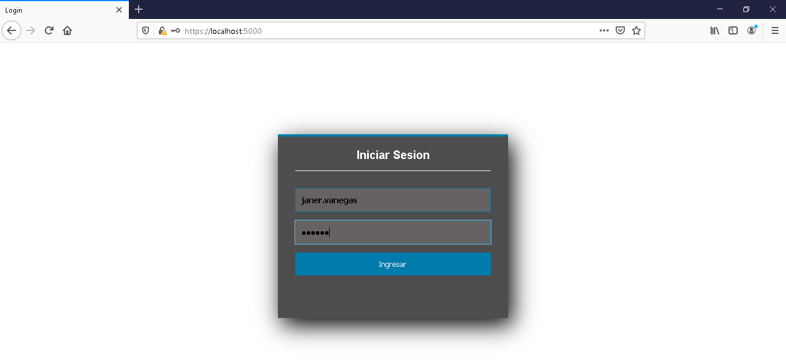
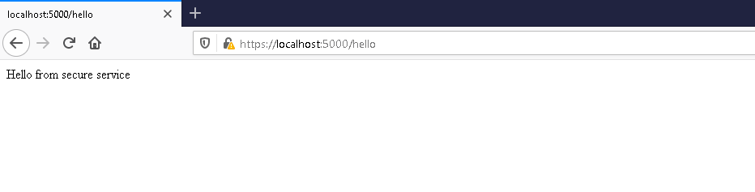

## APLICACIÓN DISTRIBUIDA SEGURA EN TODOS SUS FRENTES

En este taller se desarrollo una aplicacion web segura

### Desarrollo

Generacion de par de llaves publicas, privadas y certificado.

Exportación del certificado a un archivo

Importación del certificado al 'TrustStore'

Una vez creado las llaves, certificado, clases java, ejecutamos la aplicacion y abrimos el navegador, en la pagina de login se escribe el usuario y su respectiva contraseñas, si estos no son validos se redirigira a la pagina de login, si los datos son correctos se redirigira al servicio 'Hello'

### REQUISITOS
* Java
* Maven
* Git

### JAVADOC

Para generar la documentacion java del proyecto ejecute las siguientes instrucciones.

`mvn javadoc:javadoc`

### AUTOR
* Janer Stiven Vanegas Trujillo